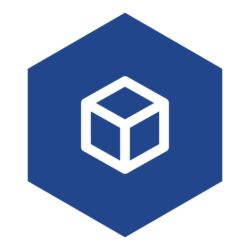
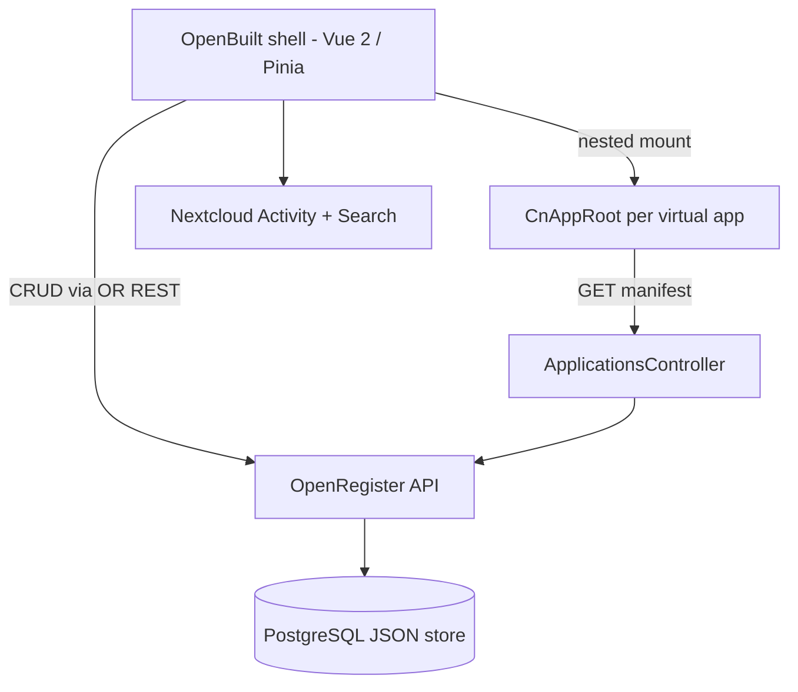

<p align="center">
  
</p>

<h1 align="center">OpenBuilt</h1>

<p align="center">
  <strong>Citizen-developer app builder for Nextcloud — compose apps from registers, connectors, workflows, and documents without code.</strong>
</p>

<p align="center">
  <a href="https://github.com/ConductionNL/openbuilt/releases"></a>
  <a href="https://github.com/ConductionNL/openbuilt/blob/main/LICENSE"></a>
  <a href="https://github.com/ConductionNL/openbuilt/actions"></a>
</p>

---

OpenBuilt is a citizen-developer app builder for Nextcloud. It lets non-technical users compose apps from the Conduction ecosystem (OpenRegister schemas, OpenConnector APIs, Procest workflows, Docudesk documents, NL Design themes, MyDash dashboards) through a visual interface, without scaffolding PHP for each new app.

Per [ADR-024](../hydra/openspec/architecture/adr-024-app-manifest.md) each built app is rendered at runtime by mounting `CnAppRoot` with the app's manifest, which lives as a JSON blob in OpenBuilt's own OpenRegister namespace. Per [ADR-031](../hydra/openspec/architecture/adr-031-schema-declarative-business-logic.md) behaviour (state machines, aggregations, calculations, notifications) is declared as schema metadata in the register file instead of service code. Built apps are virtual at first (records in OpenBuilt's register, rendered inside the OpenBuilt shell at `/apps/openbuilt/builder/{slug}`); a Phase-2 export generates a real Nextcloud app from a virtual app.

> **Requires [OpenRegister](https://github.com/ConductionNL/openregister)** — all virtual-app data is stored as OpenRegister objects.

## Screenshots

_Add screenshots here once the shell + textarea editor + seeded `hello-world` virtual app are merged._

## Features

Features are defined in [`openspec/specs/`](openspec/specs/) and tracked via the 9-spec chain that starts with [`bootstrap-openbuilt`](openspec/changes/bootstrap-openbuilt/).

### Spec #1 — bootstrap-openbuilt (this release)
- **`Application` + `BuiltAppRoute` OR schemas** with declarative `draft → published → archived` lifecycle (canonical ADR-031 example — no service class)
- **Manifest endpoint** — `GET /index.php/apps/openbuilt/api/applications/{slug}/manifest` returns the stored manifest blob
- **Nested-`CnAppRoot` runtime** — `/builder/{slug}/*` mounts a virtual app inside the OpenBuilt shell; path segments after the slug forward to the inner manifest's router
- **Textarea manifest editor** — JSON-only for v1 (visual editor lives in chain spec #5)
- **Seeded `hello-world` Application** exercising `index`, `detail`, and `form` page types out of the box

### Chained follow-on specs
- `nextcloud-vue-in-memory-manifest` (in `nextcloud-vue/`) — `useAppManifest` overload accepting an in-memory manifest object
- `openregister-runtime-schema-api` (in `openregister/`) — runtime schema-creation API
- `openbuilt-schema-editor` — visual schema designer
- `openbuilt-page-editor` — visual manifest/page designer
- `openbuilt-versioning` — draft / publish / rollback
- `openbuilt-rbac` — per-built-app permissions
- `openbuilt-templates-marketplace` — starter templates
- `openbuilt-export-to-real-app` — Phase-2 export to a real Nextcloud app

## Architecture



### Data Model

| Schema | Description |
|--------|-------------|
| `Application` | One row per virtual app. Holds `slug`, `name`, `description`, `manifest` (JSON blob), `version`, `status` (draft / published / archived). Declarative lifecycle via `x-openregister-lifecycle`. |
| `BuiltAppRoute` | Slug → applicationUuid index for fast runtime lookup; upkept by the Application lifecycle. |
| `hello-message` | Seed schema for the canonical `hello-world` virtual app (three sample objects). |

Data model is fully defined in [`lib/Settings/openbuilt_register.json`](lib/Settings/openbuilt_register.json). See [`openspec/changes/bootstrap-openbuilt/`](openspec/changes/bootstrap-openbuilt/) for the foundational spec.

## Requirements

| Dependency | Version |
|-----------|---------|
| Nextcloud | 28 – 33 |
| PHP | 8.1+ |
| Node.js | 20+ |
| [OpenRegister](https://github.com/ConductionNL/openregister) | latest |
| [@conduction/nextcloud-vue](https://www.npmjs.com/package/@conduction/nextcloud-vue) | latest |

## Installation

### From the Nextcloud App Store

1. Go to **Apps** in your Nextcloud instance
2. Search for **OpenBuilt**
3. Click **Download and enable**

> OpenRegister must be installed first. [Install OpenRegister →](https://apps.nextcloud.com/apps/openregister)

### From Source

```bash
cd /var/www/html/custom_apps
git clone https://github.com/ConductionNL/openbuilt.git openbuilt
cd openbuilt
npm install && npm run build
php occ app:enable openbuilt
```

## Development

### Frontend development

```bash
npm install
npm run dev        # Watch mode
npm run build      # Production build
```

### Code quality

```bash
# PHP
composer check:strict   # PHPCS + PHPMD + Psalm + PHPStan + tests
composer cs:fix         # Auto-fix PHPCS
composer phpmd          # Mess detection

# Frontend
npm run lint            # ESLint
npm run stylelint       # CSS linting
```

> **Note:** The `js/` build output is not committed. Build the frontend before enabling the app or the UI will be blank.

## Tech Stack

| Layer | Technology |
|-------|-----------|
| Frontend | Vue 2.7, Pinia, `@conduction/nextcloud-vue` (`CnAppRoot`, `CnPageRenderer`, `useAppManifest`) |
| Build | Webpack 5, @nextcloud/webpack-vue-config |
| Backend | PHP 8.1+, Nextcloud App Framework (single controller method: manifest endpoint) |
| Data | OpenRegister (PostgreSQL JSON objects + `x-openregister-lifecycle` declarative state machines) |
| Quality | PHPCS, PHPMD, Psalm, PHPStan, ESLint, Stylelint |

## Branches

| Branch | Purpose |
|--------|---------|
| `main` | Stable releases — triggers release workflow |
| `beta` | Beta / pre-release builds |
| `development` | Active development — merge target for feature branches |

## Documentation

| Resource | Description |
|----------|-------------|
| [`openspec/app-config.json`](openspec/app-config.json) | App identity, dependencies, CI configuration |
| [`openspec/changes/bootstrap-openbuilt/`](openspec/changes/bootstrap-openbuilt/) | Foundational spec (proposal, specs, design, tasks) |
| [`openspec/specs/`](openspec/specs/) | Feature specs |
| [`openspec/architecture/`](openspec/architecture/) | App-specific Architectural Decision Records |

## Standards & Compliance

- **Accessibility:** WCAG AA (NL Design System guarantees, ADR-010)
- **Authorization:** RBAC via OpenRegister (ADR-022) — no app-local RBAC duplication
- **Audit trail:** Full lifecycle audit on every Application transition via OR's audit trail
- **Localization:** English and Dutch (ADR-007)

## Related Apps

- **[OpenRegister](https://github.com/ConductionNL/openregister)** — Object storage layer (required dependency)
- **[OpenConnector](https://github.com/ConductionNL/openconnector)** — API / iPaaS integration (consumed by built apps via manifest)
- **[Procest](https://github.com/ConductionNL/procest)** — Process / case management (consumed via workflow attachments)
- **[Docudesk](https://github.com/ConductionNL/docudesk)** — Document generation (consumed via template attachments)
- **[MyDash](https://github.com/ConductionNL/mydash)** — Dashboards (consumed via widget embeds)
- **[NL Design](https://github.com/ConductionNL/nldesign)** — Government theming (CSS variable inheritance)

## Support

For support, contact [support@conduction.nl](mailto:support@conduction.nl).

For a Service Level Agreement (SLA), contact [sales@conduction.nl](mailto:sales@conduction.nl).

## License

This project is licensed under the [EUPL-1.2](LICENSE).

## Authors

Built by [Conduction](https://conduction.nl) — open-source software for Dutch government and public sector organizations.
