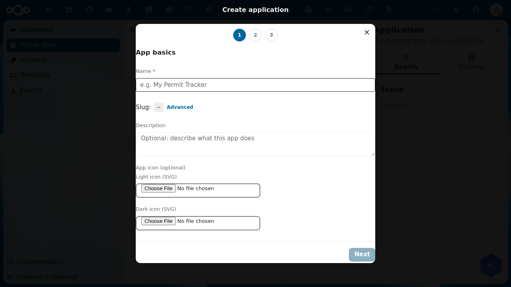
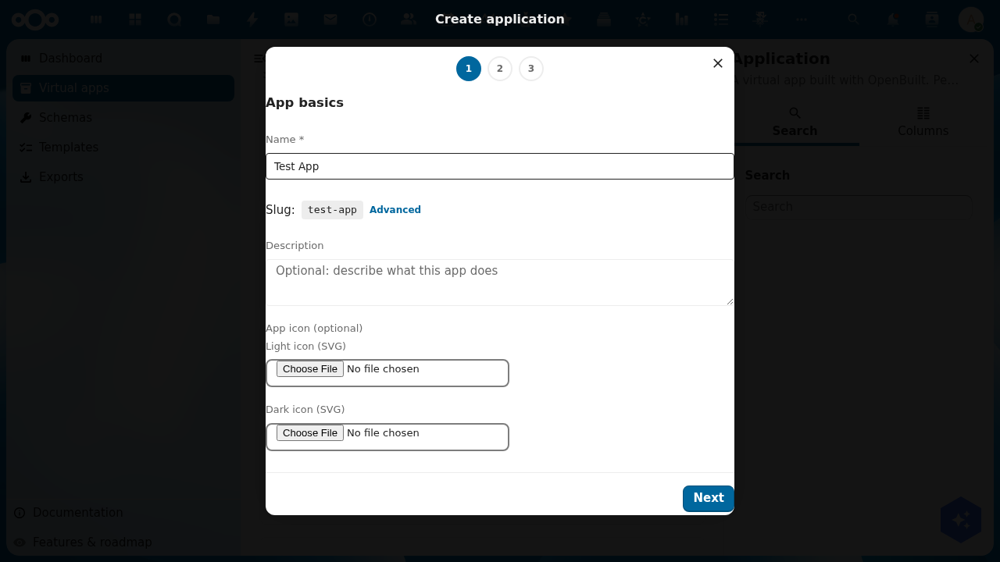
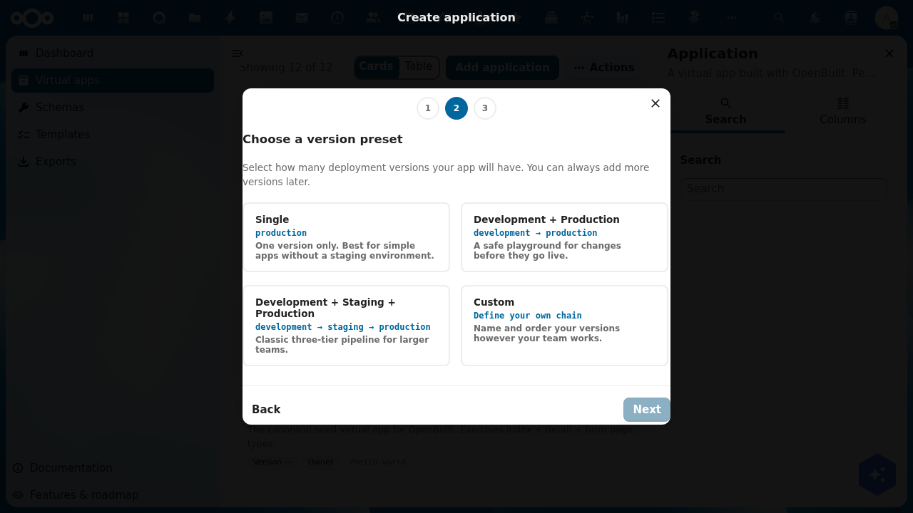
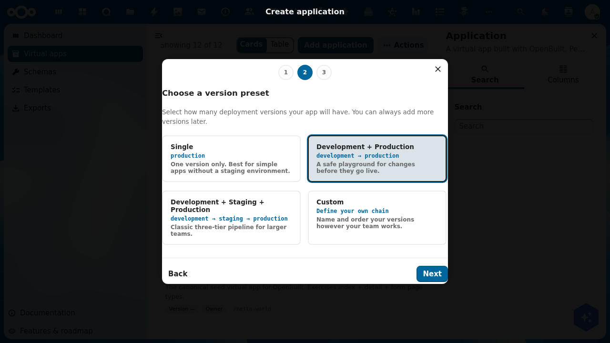
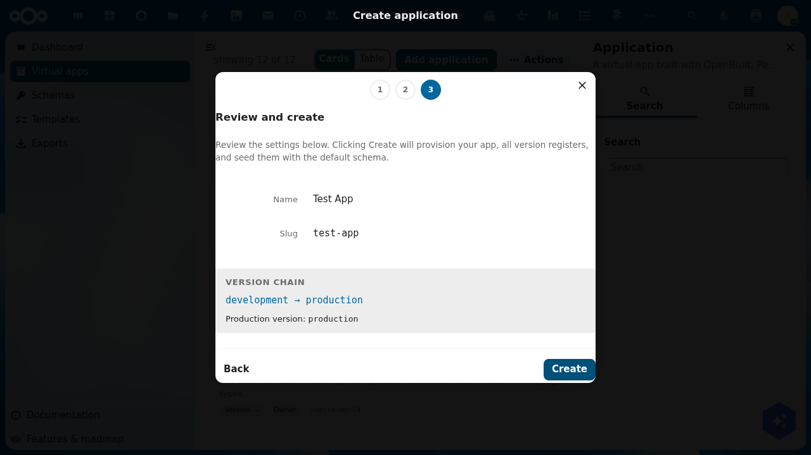

# Tutorial: Create a virtual app

> **Audience**: OpenBuilt admins creating their first virtual app on a fresh install or alongside existing apps.
> **Prereqs**: OpenBuilt + OpenRegister installed and enabled. Signed in as a Nextcloud user (admin or otherwise).
> **Outcome**: A new virtual app named **Test App** with a `development → production` linear version chain, both versions seeded with an empty register and the default `hello-message` schema. Caller becomes the app's sole owner.

## 1. Open the wizard

Navigate to **Virtual apps** in the OpenBuilt sidebar and click **Add application** (the blue secondary button in the actions bar).

The wizard opens on Step 1 — *App basics*.

The dialog header shows a three-step indicator (1 → 2 → 3). Step 3 in this preset path is the Review screen; selecting the **Custom** preset later swaps in a chain composer as step 3 and pushes Review to step 4.

## 2. Step 1 — App basics

Fill in:

- **Name** (required) — the human-readable display label. e.g. *Test App*.
- **Slug** — auto-derived from the name in `kebab-case`. Click the **Advanced** link if you want to override it manually (must match `^(?!_)[a-z0-9][a-z0-9-]*[a-z0-9]$`; leading underscores are reserved for openbuilt system use).
- **Description** (optional) — long-form text describing what the app does.
- **App icon** (optional, both light + dark) — upload SVGs that will appear in the Nextcloud top bar once the app is published.

When **Name** is valid, the **Next** button in the footer enables.

## 3. Step 2 — Choose a version preset

Pick the shape of your version chain. ADR-002's linear-chain model uses these presets out of the box:

| Preset | Chain | Best for |
|--------|-------|----------|
| **Single** | `production` | One-version apps with no staging environment. |
| **Development + Production** | `development → production` | The common "I want a safe playground" case. |
| **Development + Staging + Production** | `development → staging → production` | Classic three-tier pipeline for larger teams. |
| **Custom** | Admin-defined chain | When your team's deployment vocabulary doesn't fit the canned options. |

Selecting **Custom** swaps in step 3 with an add-row composer where you type each version's name and the slug auto-derives; rows are drag-reorderable; top-to-bottom is upstream-to-downstream.

For this tutorial we select **Development + Production**.

## 4. Step 3 — Review and create

The Review screen shows everything the wizard is about to provision:

- **Name** and **slug** from step 1.
- **Version chain** in arrow form (`development → production`).
- **Production version** callout naming which version end users will see at the canonical `/apps/openbuilt/{slug}` URL.

Click **Create** to submit. The backend then runs atomically:

1. Validate the whole payload.
2. Create the `Application` record (caller becomes `owners` per RBAC).
3. For each version in chain order: create the `ApplicationVersion` record + provision the per-version register `openbuilt-{appSlug}-{versionSlug}` + install the default schema set with version-namespaced slugs.
4. Wire each non-terminal version's `promotesTo` to the next downstream version's UUID.
5. Set `Application.productionVersion` to the terminal version's UUID.

On any failure, all already-created objects roll back in reverse creation order. On success, the wizard closes and you land on the new app's detail page at `/apps/openbuilt/applications/<uuid>`.

## 5. What you have now

- One `Application` record with your slug.
- Two `ApplicationVersion` records (`development`, `production`) chained linearly.
- Two per-version OR registers (`openbuilt-test-app-development`, `openbuilt-test-app-production`).
- Each register seeded with the `hello-message` schema (namespaced as `test-app-development-hello-message` and `test-app-production-hello-message` to satisfy OR's org-wide schema-slug uniqueness constraint).

## What's next

- **Schema design** — open the version's schema designer at `/builder/{slug}/schemas?_version=development` to model your domain.
- **Page design** — open the page designer at `/builder/{slug}/pages?_version=development` to lay out your app's screens.
- **Promote** — when development looks ready, use the Promote action on the version detail page to push your changes through to production. The promote dialog asks how to handle the target's existing data (start fresh from source / migrate-with-schema-changes / empty-start).

## Troubleshooting

- **"Add Item" button instead of "Add application"** — the manifest's `actionsComponent` must sit at page top-level (sibling to `id`/`route`/`type`/`title`), not nested inside `config`. The default CnIndexPage Add button is independent; suppress it with `config.showAdd: false` if needed.
- **`[object Object]` in OR API URLs** — your local nc-vue version pre-dates the positional-arg fix in `CnIndexPage.registerObjectType`. Update nc-vue or copy the fix from `feature/openbuilt-version-routing` / this branch.
- **Schema uniqueness violation on create** — the org-wide schema-slug constraint requires per-app namespacing of seed schema slugs. The wizard applies `{appSlug}-{versionSlug}-` as a prefix; if you fork the wizard's seed list, keep the namespacing pattern.
- **Hello World apps don't disappear after upgrade** — the green-field migration step's idempotency check is too eager. See [issue #69](https://github.com/ConductionNL/openbuilt/issues/69).
- **Icons return 404 from `/apps/openbuilt/icons/{slug}.svg`** — see [issue #68](https://github.com/ConductionNL/openbuilt/issues/68).
