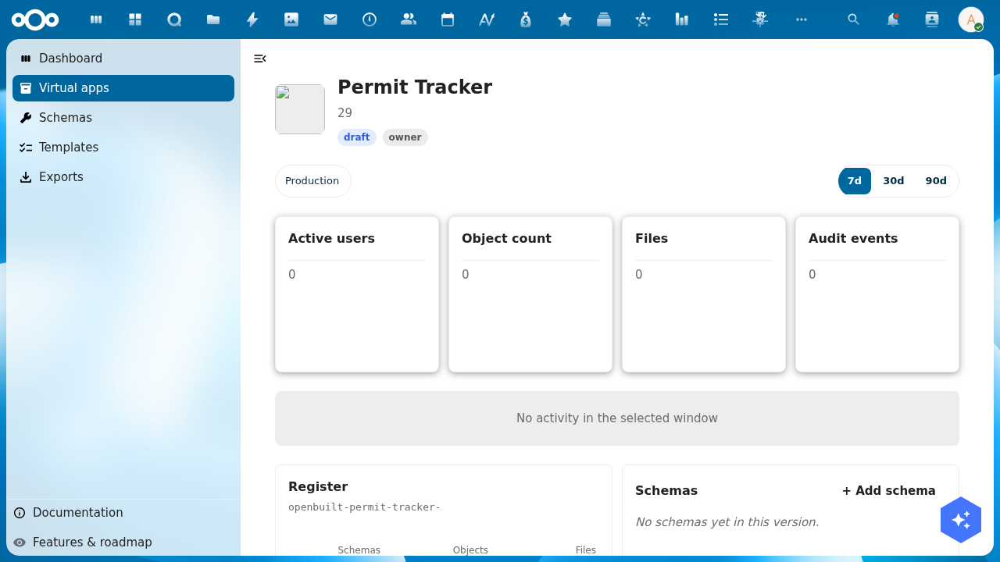
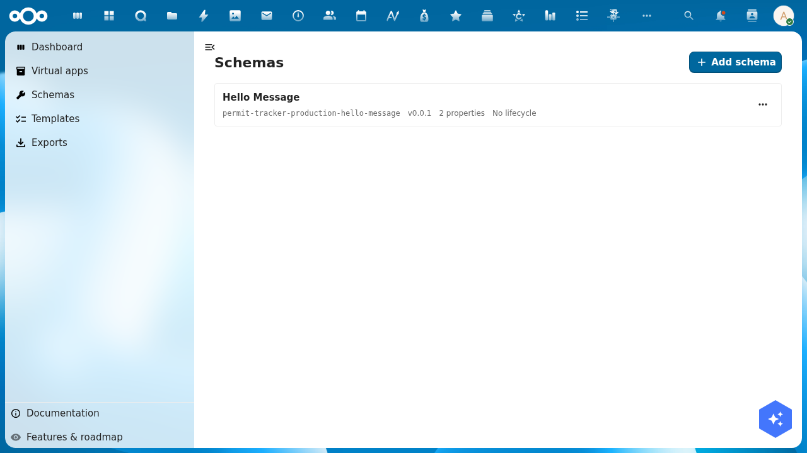
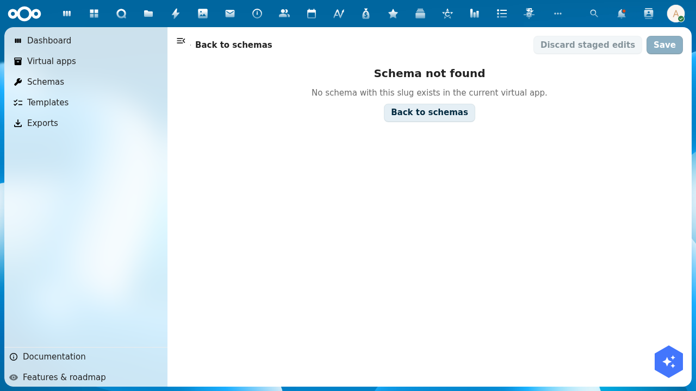

# Tutorial: Update a virtual app

> **Audience**: OpenBuilt admins who have already created an app via the wizard and want to evolve it — design schemas, edit pages, switch between versions, and promote changes through the chain.
> **Prereqs**: A virtual app already exists in OpenBuilt (see [Create a virtual app](./create-a-virtual-app.md)). The example here continues with `Permit Tracker` using the `development → production` preset.
> **Status**: Several parts of the update flow work today; some have known issues filed as follow-up bugs and noted inline.

## 1. Open the app detail page

Navigate to **Virtual apps** in the sidebar, then click your app's card. The detail page renders the maintainer dashboard:

You see:
- **Hero**: app name, status badge (`draft`), role badge (`owner`).
- **Version pill tabs**: each ApplicationVersion in the chain. The production version is always present.
- **Window toggle** (7d / 30d / 90d): scopes the activity-graph + active-users KPI.
- **KPI cards** — 4 metrics scoped to the currently-selected version's register: Active users, Object count, Files, Audit events.
- **Activity graph** placeholder (empties out before any events accumulate).
- **Structural widgets** — Register, Schemas, Groups & users, Pages, Menu — each linking out to the corresponding designer.

> **Known issue**: the development pill doesn't yet render alongside Production in some scenarios — see [issue tracker](https://github.com/ConductionNL/openbuilt/issues) for the latest.

## 2. Open the schema designer for a version

From the detail page, the **Schemas** widget shows the schemas installed in the currently-selected version's register, with a deep-link to the schema designer. Alternatively, type the URL directly:

- Production: `/apps/openbuilt/builder/{appSlug}/schemas?_version=production`
- Development: `/apps/openbuilt/builder/{appSlug}/schemas?_version=development`

The `_version` query parameter uses the underscore-prefix convention (see ADR-002 and the routing spec) so it can't collide with user-defined `?version=` params that virtual apps might surface.

Each list row shows the schema's display name, slug, version, property count, and lifecycle. Note the schema slug is **namespaced** with `{appSlug}-{versionSlug}-` — every wizard-provisioned seed schema is prefixed this way to satisfy OR's organization-wide schema-slug uniqueness constraint. So `hello-message` becomes `permit-tracker-production-hello-message`.

## 3. Edit a schema

> **Known issue**: clicking a schema row to open its detail page currently returns "Schema not found":
>
> 
>
> The list view correctly fetches schemas scoped by register, but the detail view's lookup pathway doesn't yet account for the namespaced slug. Filed as a follow-up bug — once it's resolved, the editor flow continues from this step.

Until the detail view is fixed, schema edits need to go via the OR API directly, or via the OpenRegister admin UI at `/apps/openregister/schemas`.

## 4. Switch versions

The version pill tabs at the top of the detail page (and on builder pages) flip the `?_version=` URL parameter. Bookmark a specific tier (e.g. `/apps/openbuilt/applications/{uuid}?_version=development`) and your browser session pins to that tier until you switch.

Non-admins only see the production tier. Editor + owner roles also see all non-production tiers (development, staging, etc.). Per ADR-002, NC admins are NOT auto-granted access — they must be in the Application's `permissions.{owners,editors}` arrays.

## 5. Promote from development → production

When development changes look ready, navigate to the development version's detail page or the version pill's actions menu and click **Promote**. A dialog opens asking how to handle the target's existing data:

- **Start target with source data** — copy development's rows into production's register, applying development's schema set. Useful when "the test data IS the new shape of prod data."
- **Migrate target's existing data** — keep production's rows, apply development's schema set + any declared migration rules. Useful for genuine app upgrades where prod data must survive.
- **Empty start** — drop production's rows, install development's schema set. Most destructive — requires typing the app slug to confirm.

The default per ADR-002 is **migrate-existing** when promoting to the production version (preserve prod data), **start-with-source** for promotions between non-production tiers. The dialog UI is implemented in `src/dialogs/PromoteVersionDialog.vue`; the backend endpoint is `POST /api/applications/{appUuid}/versions/{versionUuid}/promote`.

> **End-to-end promotion testing is still gated** by the schema-detail bug above — until schemas can be edited, the development version's content has nothing new to promote. File or watch follow-up issues to confirm when the promote flow is testable end-to-end.

## 6. What works today vs. what doesn't

| Step | Status |
|------|--------|
| Open detail page | ✅ Works — hero, KPIs, structural widgets all render |
| List schemas for a version | ✅ Works — `/builder/{slug}/schemas?_version=...` shows namespaced slugs |
| Edit a schema | ❌ Detail view 404s on namespaced slug — see follow-up |
| Switch between versions via URL | ✅ Works via `?_version=` |
| See development pill alongside Production | ⚠ Only Production currently renders — follow-up |
| Promote via dialog | ⏸ Untested end-to-end (blocked by schema edit) |

## Troubleshooting

- **Hero shows "Untitled application"** — the header was binding to a slot prop that CnDetailPage doesn't forward. The fix in `feature/openbuilt-wizard-and-data-fetch` (commit `82dc21c`) makes the header fetch the Application record via OR's API on mount.
- **Schema detail shows "Schema not found"** — the schema-namespacing fix from the wizard creates slugs like `{appSlug}-{versionSlug}-{slug}`. The schema-designer detail view's lookup doesn't honor this prefix yet. Workaround: edit via OR's admin UI.
- **Register slug truncated to `openbuilt-{slug}-`** — display-only formatting issue in the Register widget; underlying register is correctly named `openbuilt-{appSlug}-{versionSlug}`.
- **Description field shows a number** — the header's `applicationDescription` computed reads the wrong field on the resolved Application object. Cosmetic.
